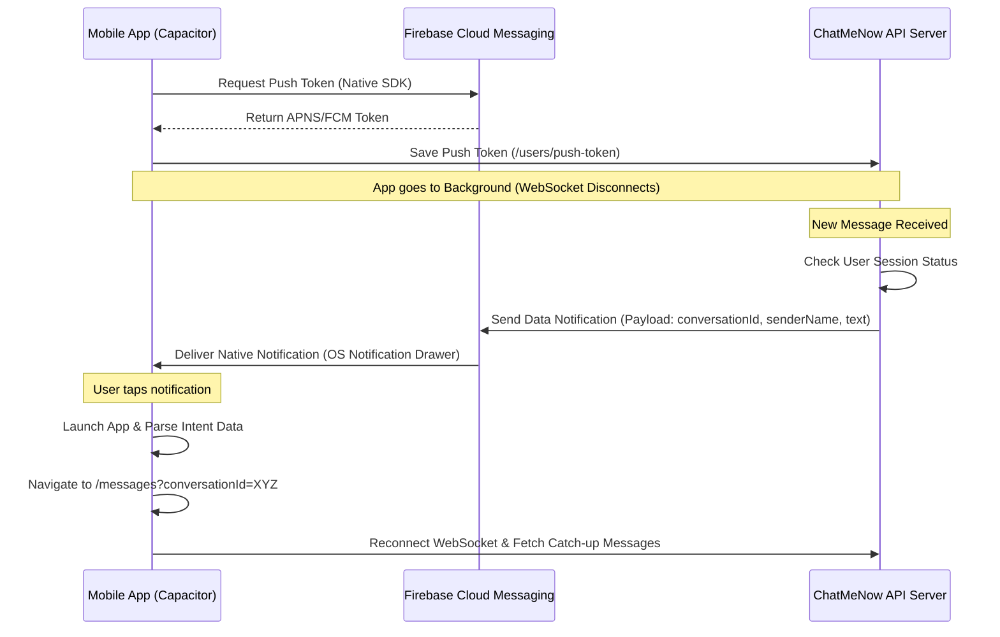

# 📱 PUSH NOTIFICATIONS & BACKGROUND SYNC INTEGRATION GUIDE

Real-time WebSocket connections (`socket.io`) are highly efficient while the application is active in the foreground. However, mobile operating systems (Android & iOS) aggressively suspend background processes, sleep network sockets, and recycle WebViews to save battery.

To guarantee that users receive messages and call alerts in real-time when the app is minimized or closed, **Firebase Cloud Messaging (FCM)** must be integrated as a fallback channel.

---

## 🎯 Architecture Flow



---

## 1. ⚙️ Installation & App Setup

### Frontend Packages
Install the official Capacitor Push Notifications plugin:
```bash
npm install @capacitor/push-notifications
npx cap update
```

### Android Native Setup
1. Create a project in [Firebase Console](https://console.firebase.google.com/).
2. Add an Android App with the package name defined in `capacitor.config.ts` (`com.chatmenow.app`).
3. Download `google-services.json` and place it in the android directory:
   `d:\Quan_Ly_Mon_Hoc\Cong_Nghe_Moi\Chat-Me-Now\chatmenow-fe-mobile\android\app\google-services.json`
4. Add Firebase dependencies in Gradle files:
   * **Project `build.gradle` (`/android/build.gradle`)**:
     ```gradle
     dependencies {
         classpath 'com.google.gms:google-services:4.4.0'
     }
     ```
   * **App `build.gradle` (`/android/app/build.gradle`)**:
     ```gradle
     apply plugin: 'com.google.gms.google-services'
     ```

---

## 2. 🔌 Frontend Token Registration Code

Create a notification listener service (e.g., `components/providers/notification-provider.tsx`) to initialize FCM when the user logs in:

```tsx
import { useEffect } from "react";
import { PushNotifications } from "@capacitor/push-notifications";
import { Capacitor } from "@capacitor/core";
import { useRouter } from "next/navigation";
import { useAuthStore } from "@/store/use-auth-store";
import axios from "axios";

export function NotificationProvider({ children }: { children: React.ReactNode }) {
  const router = useRouter();
  const token = useAuthStore((state) => state.token);

  useEffect(() => {
    if (!Capacitor.isNativePlatform() || !token) return;

    // 1. Request Permission
    PushNotifications.requestPermissions().then((result) => {
      if (result.receive === "granted") {
        // 2. Register with FCM/APNS gateway
        PushNotifications.register();
      }
    });

    // 3. Capture Token and Sync to Backend
    PushNotifications.addListener("registration", (deviceToken) => {
      const deviceType = Capacitor.getPlatform(); // 'android' | 'ios'
      
      // Update this token in your API database
      axios.post(
        `${process.env.NEXT_PUBLIC_API_URL}/users/push-token`,
        { token: deviceToken.value, deviceType },
        { headers: { Authorization: `Bearer ${token}` } }
      ).catch((err) => console.error("Error saving device token:", err));
    });

    PushNotifications.addListener("registrationError", (error) => {
      console.error("FCM Registration Error: ", error);
    });

    // 4. Handle Notification Tap (Deep-Linking Route)
    PushNotifications.addListener(
      "pushNotificationActionPerformed",
      (action) => {
        const data = action.notification.data;
        if (data.conversationId) {
          // Navigate directly to target conversation
          router.push(`/messages?conversationId=${data.conversationId}`);
        }
      }
    );

    return () => {
      PushNotifications.removeAllListeners();
    };
  }, [token]);

  return <>{children}</>;
}
```

---

## 3. 🛡️ Backend Payload Structure (Node.js/Express)

When a message is sent and the recipient is **offline/disconnected**, the backend should trigger a push notification.

### Push Payload Format
```javascript
const admin = require("firebase-admin");

async function sendPushNotification(userToken, messageData) {
  const payload = {
    token: userToken,
    notification: {
      title: messageData.senderName,
      body: messageData.text || "Đã gửi một tệp đính kèm.",
    },
    data: {
      conversationId: messageData.conversationId,
      senderId: messageData.senderId,
      type: "new_message",
    },
    android: {
      priority: "high",
      notification: {
        sound: "default",
        clickAction: "FCM_OUTDOOR_ACT", // Required to open the app intent
      },
    },
    apns: {
      payload: {
        aps: {
          sound: "default",
          badge: 1,
        },
      },
    },
  };

  try {
    await admin.messaging().send(payload);
    console.log("Push notification sent successfully");
  } catch (error) {
    console.error("Error sending push notification:", error);
  }
}
```

---

## 4. 🔄 App Resume & Reconnection Policy

When the app transitions back to the foreground, the Socket.IO provider and React Query must force a synchronization of state to pull any messages that were not received while the socket was offline.

### Foreground Connection Synchronization Code
In `components/providers/socket-provider.tsx`:

```tsx
import { App } from "@capacitor/app";
import { useQueryClient } from "@tanstack/react-query";

// Inside SocketProvider component:
const queryClient = useQueryClient();

useEffect(() => {
  if (!Capacitor.isNativePlatform()) return;

  const appStateListener = App.addListener("appStateChange", ({ isActive }) => {
    if (isActive) {
      console.log("App returned to foreground. Reconnecting and syncing feeds...");
      
      // 1. Force socket reconnection
      if (socket && socket.disconnected) {
        socket.connect();
      }
      
      // 2. Refetch active queries (Conversations, Messages, Notifications)
      queryClient.invalidateQueries({ queryKey: ["conversations"] });
      queryClient.invalidateQueries({ queryKey: ["messages"] });
      queryClient.invalidateQueries({ queryKey: ["notifications"] });
    }
  });

  return () => {
    appStateListener.then(l => l.remove());
  };
}, [socket, queryClient]);
```

Implementing this FCM and App State Sync setup guarantees **zero message loss**, robust background handling, and smooth deep-linking navigation.
